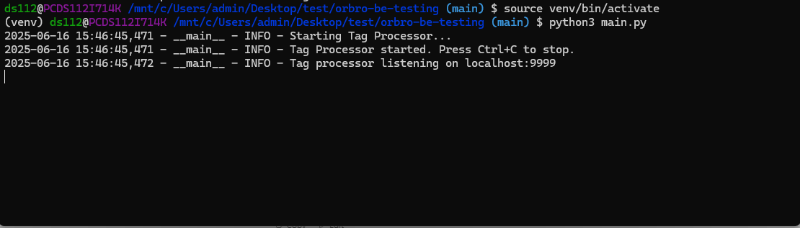
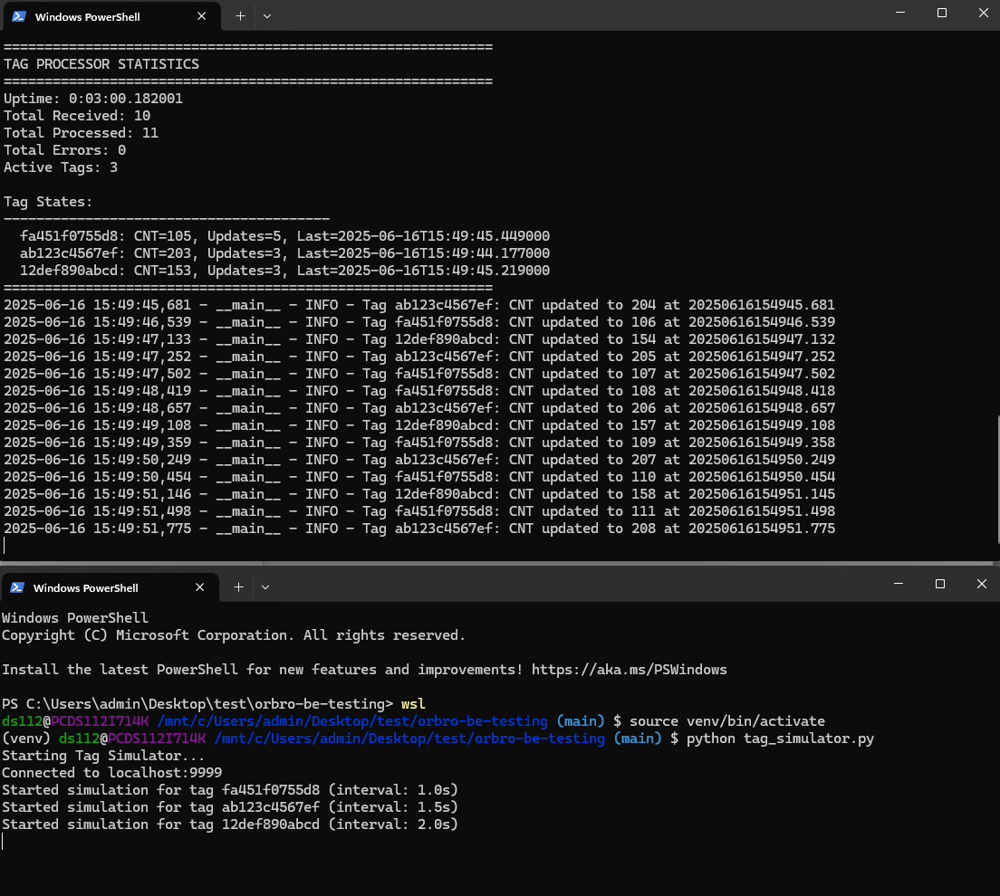
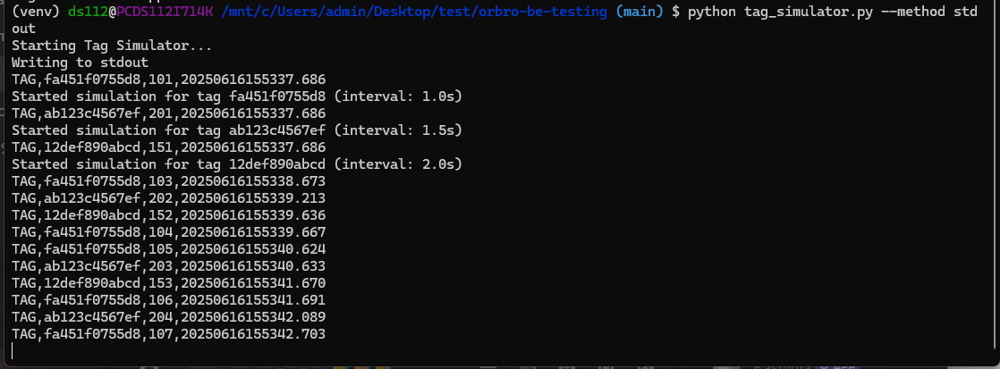
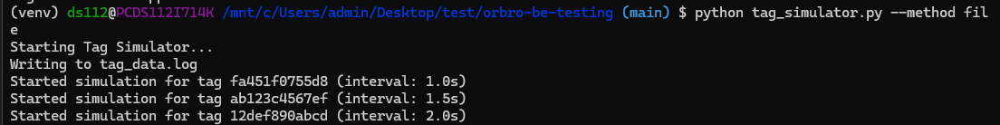
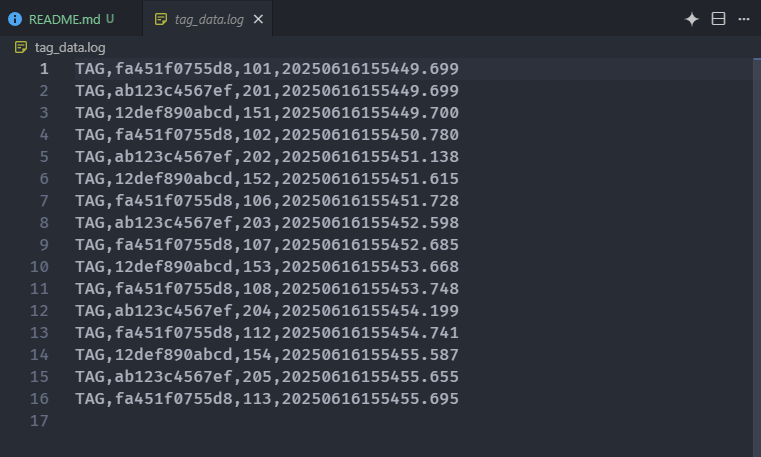
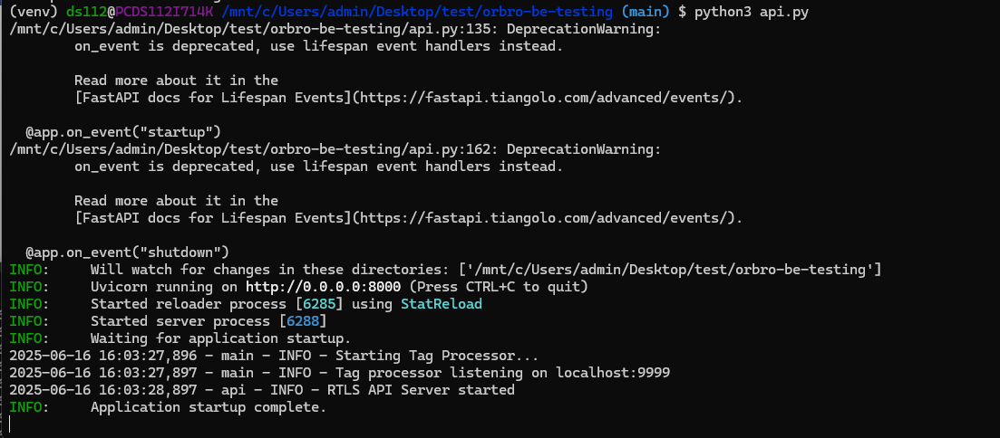
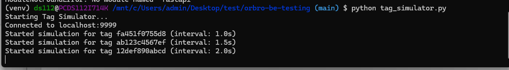
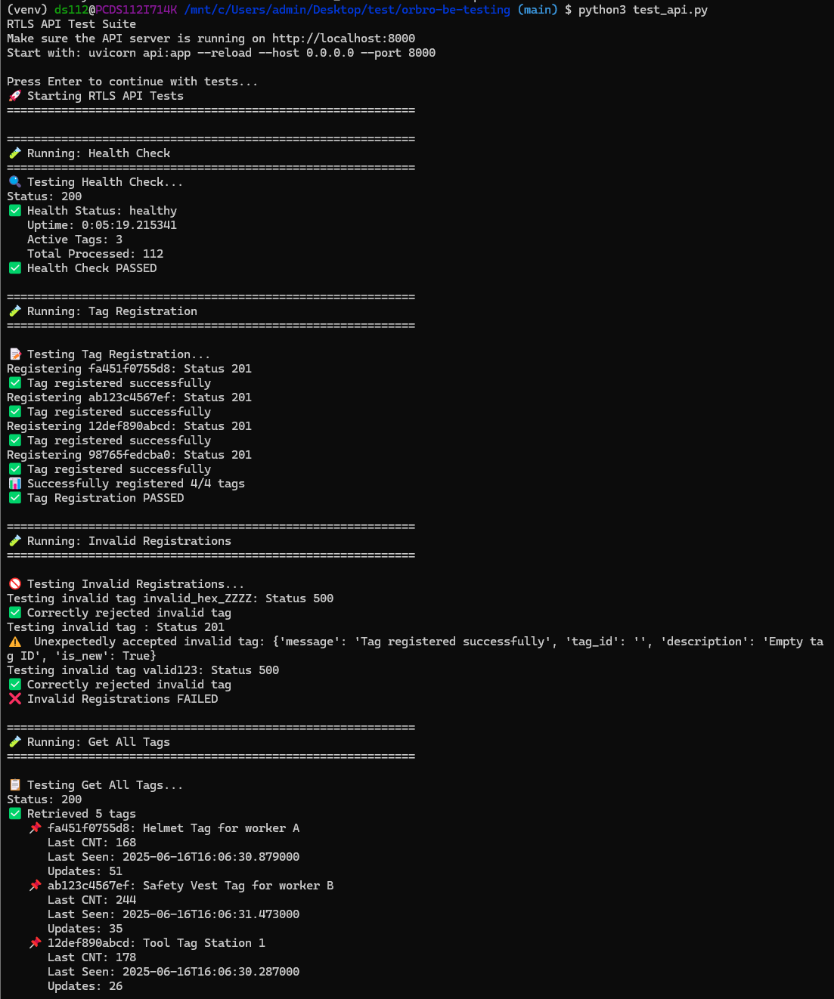

# BACKEND RTLS DEVELOPER PRACTICAL TEST – ORBRO

This project simulates a backend system that receives real-time logs from RTLS Tags, stores the latest state, and exposes a RESTful API for status queries. It is designed to run entirely on Ubuntu without requiring actual hardware devices.

---

## ✅ PROJECT STRUCTURE

```

orbro-be-testing/
├── main.py               # Core logic to receive and process logs
├── parser.py             # (Optional) Logic module for parsing logs
├── api.py                # REST API using FastAPI
├── test_api.py           # Unit tests for the API
├── db.py                 # (Optional) SQLite integration
├── tag_simulator.py      # RTLS Tag simulator (custom script)
├── requirements.txt      # Python dependencies
└── README.md             # This documentation

```

---

## ENVIRONMENT SETUP

**Requirements:**
- Ubuntu 20.04+
- Python 3.9+

### Setup Steps:
```bash
python3 -m venv venv
source venv/bin/activate
pip3 install -r requirements.txt
```

## EXECUTION METHOD

### 1. TASK 1: Tag Simulator

**Main Features**

**Tag Simulator**

* Supports 3 output methods: `socket`, `stdout`, `file`
* Creates 3 tags with different intervals
* Counter increases realistically with jitter and randomness
* Multi-threaded simulation for each tag

**Parser**

* Accurate format validation: `TAG,<tag_id>,<cnt>,<timestamp>`
* Sequence counter validation
* Buffer handling for streaming data
* Robust error handling and logging

**Main Processor**

* Real-time socket server for receiving data
* Thread-safe state management
* Logs output when CNT changes
* Statistics reporting
* Supports multiple concurrent clients

---

**How to Run**

**Step 1: Setup Environment**

```bash
python3 -m venv venv
source venv/bin/activate
pip install -r requirements.txt
```

**Step 2: Run Main Processor**

```bash
python3 main.py
```



**Step 3: Run Tag Simulator (in a separate terminal)**

```bash
# Socket mode (default)
python tag_simulator.py

# Or stdout mode
python tag_simulator.py --method stdout

# Or file mode
python tag_simulator.py --method file
```
***Socket mode***




**stdout mode**




**file mode**





### **❓ Question:** Explain the tag simulation method.

**✅ Answer:**

The **tag simulation method** is implemented in the file `tag_simulator.py` and is responsible for mimicking real-time data emission from RTLS (Real-Time Location System) tags. It is designed to generate mock data that simulates real devices operating in a live environment.

**Key Features of the Simulation:**

1. **Multiple Output Methods:**

   * The simulator supports three output options:

     * `socket`: sends data over a TCP socket (default),
     * `stdout`: prints to the terminal,
     * `file`: writes to a log file (`tag_data.log`).
   * This flexibility allows integration with different backends.

2. **Simulated Tags with Configurable Intervals:**

   * It simulates **three different tags**, each with a unique transmission interval (e.g., 1s, 1.5s, 2s).
   * Each tag has its own thread and counter (`cnt`) that increases over time.

3. **Realistic Jitter and Randomness:**

   * The counter occasionally jumps by random values to simulate realistic signal fluctuation.
   * Transmission intervals also include small timing jitter (`±0.1s`), adding realism.

4. **Multi-threaded Simulation:**

   * Each tag runs in its **own thread**, allowing independent, parallel data generation.
   * This models the behavior of physical devices broadcasting asynchronously.

5. **Log Format:**

   * The simulator emits data in the format:

     ```
     TAG,<tag_id>,<cnt>,<timestamp>
     ```

     Example:

     ```
     TAG,fa451f0755d8,198,20250616110501.456
     ```

**Integration with Parser:**

The data emitted from the simulator is designed to be consumed by the log parser (see `parser.py`). The parser validates the format, checks for counter sequence consistency, and extracts tag metadata for further processing.


**Summary:**

The simulation approach closely replicates real RTLS tag behavior using multithreaded, jittered, and formatted data output. It serves as a realistic and flexible source for testing backend processing, validation, and API exposure in a development environment without physical devices.

---

### 2. TASK 2: API SERVER
🔴 ***Important: Before run api server please shutdown task 1 first!***

#### 2.1. How to run API server

**Step 1: Run API Server**

```bash
python3 api.py
```



**Step 2: Run Tag Simulator (in a separate terminal)**


```bash
# Socket mode (default)
python tag_simulator.py
```




#### 2.2. API TESTING
**Register a Tag**

```bash
curl -X POST http://localhost:8000/tags \
  -H "Content-Type: application/json" \
  -d '{"id": "fa451f0755d8", "description": "Helmet Tag for worker A"}'
```

**Get all Tags**

```bash
curl http://localhost:8000/tags
```

**Get a specific Tag**

```bash
curl http://localhost:8000/tag/fa451f0755d8
```

**Health Check**

```bash
curl http://localhost:8000/health
```

#### 2.3. Unit Testing (optional)

```bash
python3 test_api.py
```




### 3. TASK 3: Question:
**Review memory structure and propose improvements (30 minutes)**  
● Analyze the following code snippet and identify at least **2 issues**, along with proposed solutions:

```python
tag_log = []

def log(tag_id, cnt, timestamp):
    tag_log.append((tag_id, cnt, timestamp))
```

**Answer:**

The above code has two critical issues related to **memory management** and **thread safety** that may affect system stability in a real-time backend application.


### Issue 1: **Unbounded Memory Growth (Memory Leak)**

#### Explanation:

* The `tag_log` list grows indefinitely with every `log()` call.
* In a real-world scenario, with tags sending data multiple times per second, this leads to **excessive memory consumption** and eventually crashes the system.

#### Solution:

Use a fixed-size buffer with `collections.deque` to retain only the most recent N entries.

```python
from collections import deque

tag_log = deque(maxlen=1000)  # Keeps the last 1000 log entries
```

---

### Issue 2: **Not Thread-Safe**

#### Explanation:

* If multiple threads log concurrently, appending to `tag_log` can result in **race conditions**.
* This can corrupt log data, cause inconsistent states, or crash the program unexpectedly.

#### Solution:

Use a `threading.Lock` to ensure safe concurrent access to the log buffer.

```python
import threading
from collections import deque

tag_log = deque(maxlen=1000)
log_lock = threading.Lock()

def log(tag_id, cnt, timestamp):
    with log_lock:
        tag_log.append((tag_id, cnt, timestamp))
```


## Improved Code

```python
from collections import deque
import threading

# Thread-safe, fixed-size log buffer
tag_log = deque(maxlen=1000)
log_lock = threading.Lock()

def log(tag_id, cnt, timestamp):
    with log_lock:
        tag_log.append((tag_id, cnt, timestamp))
```

This improved implementation ensures that the system remains **memory-efficient**, **stable**, and **safe in concurrent environments**.

